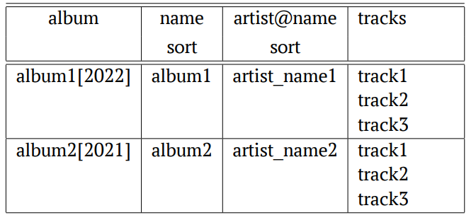
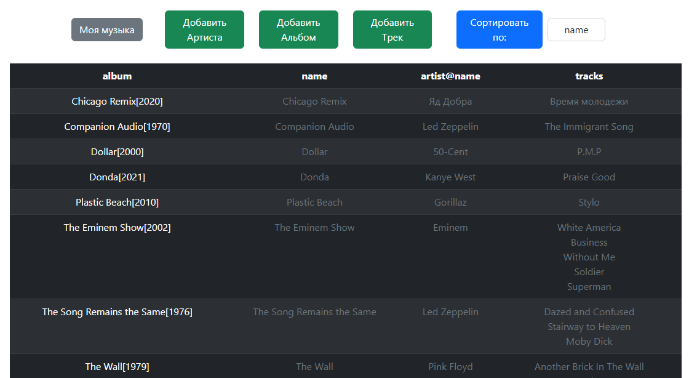
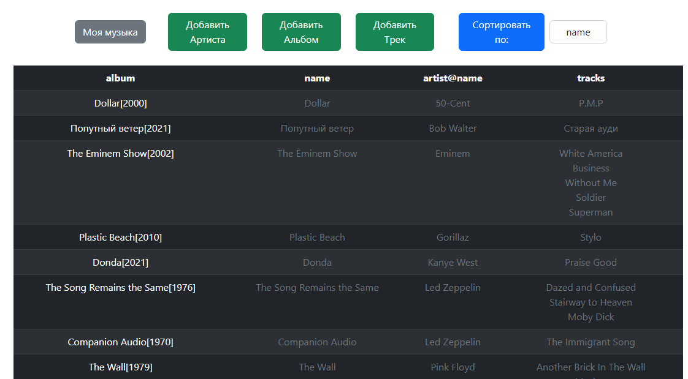
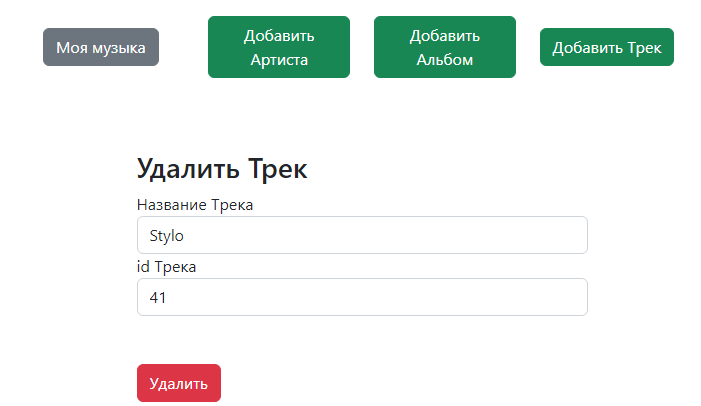
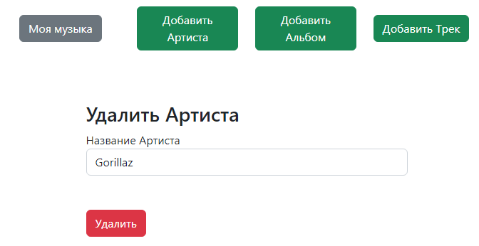
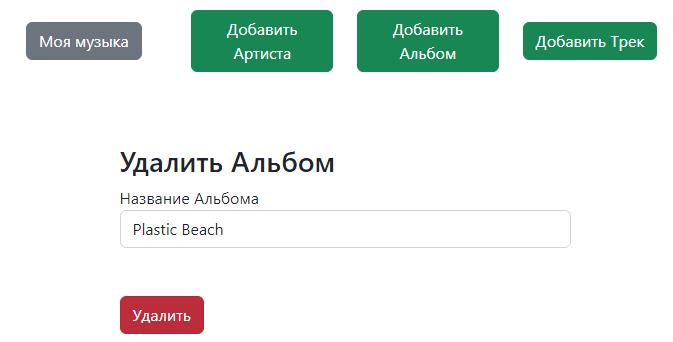
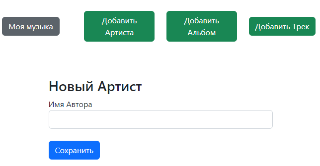
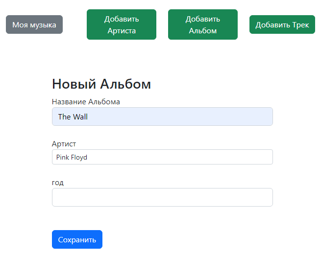

# Формирование API c помощью Django Rest Framework
<a name="оглавление"></a>
* [Задача](#Задача)
* [Решение](#Решение)
* [GET, POST (проверка API запросов)](#проверка)
* [**Web сервис на Django**](#Web_сервис_на_Django)
* [Инструкция по запуску веб сервиса (docker)](#Инструкция_по_запуску)

<a name="Задача"></a>
### Задача: 
#### Приложение содержит три модели:
* **Album** с полем _name_, содержащим название альбома в виде строки, _artist_, указывающий на модель **Artist**, _year_ - год выпуска альбома в виде целого числа.
Также модель должна иметь строковое представление в виде - _name[year]_;
* **Artist** с полем _name_, содержащим имя автора в виде строки;
* **Track** с полем _name_ в виде строки, и с полем _album_ указывающим на модель
**Album**.

На главной странице отображается таблица с заголовками _album, name,
artist@name, tracks_ и строкой под заголовками, с кнопками сортировки по
_album_name, artist@name._



При загрузке страницы должны подгружаться данные из API, в виде списка словарей и
загружаться в таблицу.
```shell
[{
"album": "album1[2022]",
"name":"album1",
"artist@name":"artist_name1",
"tracks":["track1","track2","track3"]
}, ...]

```

Причём:
1. в колонке _album_ содержится строковое представление объекта модели **Album**;
2. в колонке _name_ содержится поле _name_ объекта модели **Album**;
3. в колонке _artist@name_ содержится поле _name_ объекта модели **Artist**, связанной с данным объектом модели **Album**;
4. в колонке _tracks_ содержатся поля _name_, всех объектов модели **Track** связанных
с данным объектом модели **Album**.

При нажатии на кнопку _Sort_ происходит сортировка по данной колонке: на API отправляется запрос с параметром _sorting_ равному названию колонки и производится сортировка по _sorting_, при этом должна быть осуществлена логика, по которой вложенные
поля разделяются знаком @. Отсортированные данные передаются по API и загружаются в таблицу.

<a name="Решение"></a>
[оглавление](#оглавление)

### Решение 

В файле _models.py_ определены модели:
```shell
class Artist(models.Model):
    name = models.CharField(max_length=200)

class Album(models.Model):
    name = models.CharField(max_length=200)
    artist = models.ForeignKey(Artist, on_delete=models.CASCADE, null=True)
    year = models.IntegerField(blank=True,
                               validators=[MinValueValidator(1700), MaxValueValidator(2030)])
    def album(self):
        name_year_str = f'{self.name}[{self.year}]'
        return name_year_str

class Track(models.Model):
    name = models.CharField(max_length=200)
    album = models.ForeignKey(Album, related_name='tracks', on_delete=models.CASCADE, null=True)

```

В файле _serializers.py_ определим сериализацию объектов моделей:
```shell
class TrackSeializer(serializers.ModelSerializer):
    album = serializers.SlugRelatedField(slug_field="name", read_only=True, many=False)
    class Meta:
        model = Track
        fields = ['album', 'name']

class AlbumSeializer(serializers.ModelSerializer):
    artist = serializers.SlugRelatedField(slug_field="name", read_only=True, many=False)
    tracks = serializers.StringRelatedField(many=True)
    class Meta:
        model = Album
        fields = ['album', 'name', 'artist', 'tracks']
```

в файле _views.py_ для получения пакета данных:
```shell
serializer = AlbumSeializer(album, many=True)
serializer_data = serializer.data
```
[оглавление](#оглавление)

<a name="проверка"></a>
### GET, POST (проверка API запросов)
Проверяем, чтобы данные из API подгружались в формате согласно заданию.
Для этого предварительно создаем объекты моделей: **Artist, Album, Track**. 
Затем используем программу **Postman** для POST, GET запросов:

1. Получим данные по всем альбом, отправив GET запрос по адресу:


```shell
http://127.0.0.1:8000/api/album
```
В результате получаем следующее:
```shell
{
    "post": [
        {
            "album": "The Wall[1979]",
            "name": "The Wall",
            "artist": "Pink Floyd",
            "tracks": [
                "Another Brick In The Wall",
                "Mother",
                "Comfortably Numb",
                "Hey You",
                "In the flesh",
                "Run Like Hell"
            ]
        },..]}
```
2. Проверим сортировку по колонке _artist@name_ и _name_ объекта модели **Artist**. Отправим на адрес, json запрос ('artist' или 'name'):
```shell
http://127.0.0.1:8000/api/sorted
{
    "sorted": "artist"
}
```
3. Чтобы добавить нового артиста, нужно по указанному адресу отправить json запрос:
```shell
http://127.0.0.1:8000/api/new_artist
{
    "name": "Gorillaz"
}
```
4. Чтобы добавить новый альбом, нужно по указанному адресу отправить json запрос:
```shell
http://127.0.0.1:8000/api/new_album
{
     "name": "Plastic Beach",
     "artist": "Gorillaz",
     "year": "2010"
}
```
5. Чтобы добавить новый трек, нужно по указанному адресу отправить json запрос:
```shell
http://127.0.0.1:8000/api/new_track
{   
     "album": "Plastic Beach",
     "name": "Stylo"
}
```
6. Чтобы удалить ранее добавленный трек, нужно по указанному адресу отправить json запрос:
```shell
http://127.0.0.1:8000/api/delete_track
{
     "name": "Stylo"
}
```
7. Чтобы удалить ранее добавленный альбом, нужно по указанному адресу отправить json запрос:
```shell
http://127.0.0.1:8000/api/delete_album
{
     "name": "Plastic Beach"
}
```
8. Чтобы удалить ранее добавленного артиста, нужно по указанному адресу отправить json запрос:
```shell
http://127.0.0.1:8000/api/delete_artist
{
     "name": "Gorillaz"
}
```
[оглавление](#оглавление)


<a name="Web_сервис_на_Django"></a>
### Web сервис на Django
Весь требуемый функционал по формированию и получения запросов по API реализован через веб интерфейс:

Сортировка по колонке "name"


Сортировка по колонке "artist@name"


Удалить трек (для удаления нажать на трек в таблице, то же самое для удаления альбома и артиста)



Удалить артиста




Удалить альбом




Добавить новый трек


Добавить нового артиста




Добавить новый альбом



[оглавление](#оглавление)

<a name="Инструкция_по_запуску"></a>
### Инструкция по запуску веб сервиса (docker)
1. перейти в папку _\rcs_drf\rcs_drf_ и в терминале ввести следующие команды:
```shell
docker-compose build
docker-compose up   
```
2. в окне браузера перейти по адресу: http://127.0.0.1:8000/


3. для доступа в панель администратора django, перейти по адресу: http://127.0.0.1:8000/admin/
```shell
Username: snchz
Password: djangodjango
```